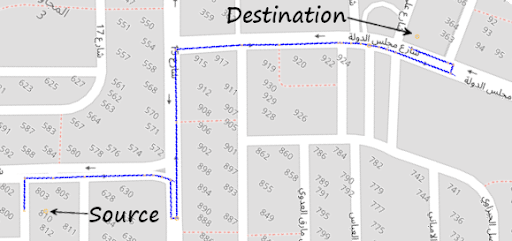
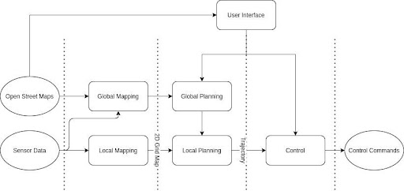
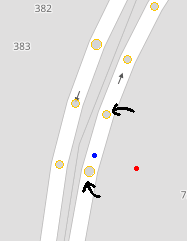
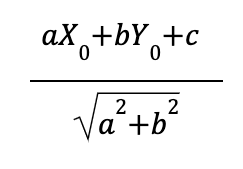
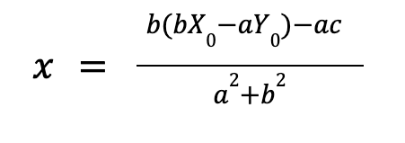
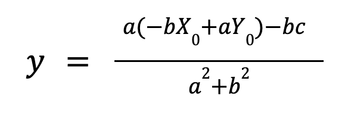
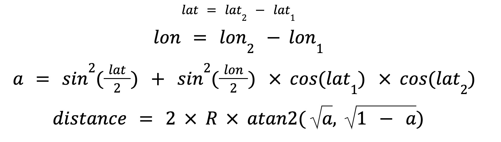
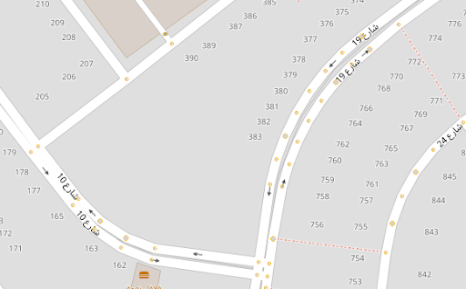
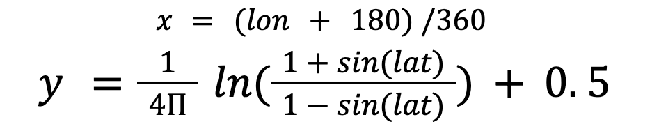

# Open Street Map Navigation
A java application that finds the shortest path between any two arbitrary locations on the map using A* algorithm, taking into consideration road directions based on data provided by OpenStreetMap project.



This project is a part of the bigger project, [RoboCab  (Autonomous Taxi)](https://github.com/KhaledMoataz/robocab)



This project implements 2 modules: Global Mapping and Global Planning

## Global Mapping

The main purpose of this module is to construct a suitable data structure for a given map, so that it can be used by the global planner to find and construct paths between different locations on a map. This module makes use of the freely available map data of OpenStreetMap project.

### Functional Description

The OpenStreetMap xml file is converted into a graph of nodes and edges, where nodes represent roads intersections and edges represent how those intersections are connected to each other. The details of roads connecting intersections also need to be captured, as this is needed to construct the final planned path.

### Modular Decomposition

Global Mapping can be decomposed into two smaller submodules: OpenStreetMap Parser and Graphs submodules.

#### OpenStreetMap Parser Submodule

OpenStreetMap map data is given in multiple formats, xml is one of them. The following snippet shows the basic structure of the OSM xml file.

```
<?xml version="1.0" encoding="utf-8"?>
<osm version="0.6">
   <bounds .../>
   <node id="298884269" lat="54.0901746" lon="12.2482632" .../>
   <node .../>
   ...
   <way id="26659127" ...>
       <nd ref="292403538"/>
       ...
       <nd ref="261728686"/>
       <tag k="highway" v="primary"/>
       <tag k="oneway" v="yes"/>
       ...
   </way>
   ...
</osm>
```

The most important units in the OSM map data are node and way. Node represents a location on the earth’s surface (latitude and longitude) and way holds the list of nodes connected together among other attributes for the rode.

Hence, the parser submodule needs to extract <node> and <way> tags. The important attributes for node tags are id, lat (latitude) and lon (longitude). Each node is extracted and passed to the graph submodule. Each way has also an id, holds a number of nodes referencing them by their ids and some attributes defined by <tag> with a key and a value. For each way, the parser submodule extracts node ids, and determines whether this way is a highway and whether it is one way. Then, encapsulates all into a way element and passes it to the graph submodule.

#### Graph Submodule

First, nodes extracted by the parser module are passed one by one to the graph submodule, which in turn stores them in a HashMap using the id as the key. Upon receiving a way element from the parser submodule, node ids are dereferenced, number of ways this node is in is incremented, highways that have the value “footway” are discarded. Nodes that exist in more than one way are identified as intersection nodes. Finally, iterating through all the ways, connecting intersection nodes only together while capturing the nodes in between. This will be used later while building the complete path. If the way is not a one way, the reverse connection needs to be added.

### Design Constraints

To make it more efficient, the parser module is not a generic xml parser. For example, “lon” attribute always comes after the “lat” attribute. The map data is assumed to be coming from OpenStreetMap website or osmium-tool.

### Other Description

Small maps can be downloaded from OpenStreetMap website as OSM xml file directly. Large maps (For example, a country) can be downloaded from geofabrik.de as pbf format and then converted to OSM xml using osmium-tool

## Global Planning

Given the graph built by the global mapping module, the main purpose of this module is to find the shortest path between any two arbitrary locations on the map taking into consideration road directions. Figure 4.3 shows an example of global planning output, a path between two arbitrary locations.


### Functional Description

After specifying source and destination locations on the map, global planning augments the graph built by the global planning module with those locations. This is done by creating two two new nodes that represent the latitudes and longitudes of the source and destination. Then, connecting those new nodes with the actual existing nodes in the graph built by the global mapping module. Now, the graph is ready to apply A* algorithm to find the shortest path between source and destination penalizing road switching. The output of the A* algorithm is a list of connected intersection nodes. This needs to be processed in order to get the complete path between source and destination (i.e. taking into account the actual nodes in OSM that connect each two subsequent intersection nodes). In order to use this complete path in the local planner, it needs further processing. The complete path is converted from latitudes and longitudes to x, y positions in meter units using the mercator projection equations. Finally, source and destination nodes are disconnected from the graph.

### Modular Decomposition

This module is composed of four submodule: Node Augmenter, A* Search Algorithm, Complete Path Construction, Mercator Projection.

#### Node Augmenter Submodule

For A* search algorithm to work correctly, source and destination nodes need to be augmented in the graph. Source and destination points are chosen by the user, they can be at any location (not necessarily inside a way). Hence, the nearest way to the selected point has to be identified, that is the way that has the segment that has the least perpendicular distance. Also, the nearest node to the selected point and nodes that define this segment have to be defined. For example, in Figure 1, if the user selected the red point, the nearest road (the one that contains the blue dot) has to be identified, the blue dot itself because it is the node to be augmented in the graph and the blue point surrounding nodes.



This can’t be done directly in latitude, longitude coordinates. Hence, we will use mercator projector equations to transform node locations to x, y coordinates. The perpendicular distance to a way segment (the distance between blue and red points) is calculated using the following equation:



Where a, b and c are the coefficients of the line equation that represent the way segment, X0 and Y0 are the coordinates of the point selected by the user (red point).

Coordinates of the node to be augmented are defined by the following equations:





After the blue node is identified, it is augmented in the way including it. If it is a destination node, the surrounding intersections nodes are connected to it respecting the way direction. If it is a source node, we first check if it is in the same way as the destination node. If so, we connect the source directly to the destination node, of course without violating the way direction. Otherwise, the source node is connected to the surrounding intersections.

#### A* Search Algorithm Submodule

A* search algorithm is implemented using a priority queue, the heuristic used is the shortest distance between the node and the destination. This is not a straight line due to earth’s surface curvature. This is calculated using the haversine distance formula as follows:




Where (lat1, lon1) and (lat2, lon2) are the coordinates of the two nodes and they are all in radians, and R is earth’s radius.

The actual cost is the travelled distance, in addition to an extra cost for switching roads.

First, the augmented source node is visited, expanded and all connected nodes are added to the priority queue after evaluating the actual cost. Then, the top node of the priority (that has the least cost) which is not visited yet, will be expanded, and so on until we reach the destination.

#### Complete Path Construction Submodule

A* algorithm gives the list of intersection nodes we need to pass on to reach the destination. However, this is not enough for the local planner. The curvature of the road needs to be captured. Figure 2 depicts OSM nodes on map. As you notice, OSM nodes capture the curvature of the roads. We eliminated these nodes to decrease the graph size for the A* search algorithm to be efficient. However, we need to add them again to obtain the complete path. When we connect two nodes in the graph, we store the way that connects the nodes, start index and end index. Hence, we can obtain the complete path again.




4.4.2.4 Mercator Projection Submodule

Mercator projection is used to convert latitude and longitude coordinates into x, y coordinates. This is done by projecting a point on earth’s surface to a cylinder. So that the earth’s surface can be drawn on a 2D surface. This conversion is used by the node augmenter submodule as mentioned above, and is also used by the local planner to set goals in the actual world. Mercator projection uses the following equations:




### Design Constraints

This module was designed to provide path planning within cities. However, we managed to load the whole map of Egypt and provide paths within milliseconds, but loading the map of Egypt in memory for the first time might take a few minutes.


### Other Description

This module is capable of planning paths across Egypt. This might not be obvious in the simulation environment as it has to be small because simulation engines need huge memory and processing power.

